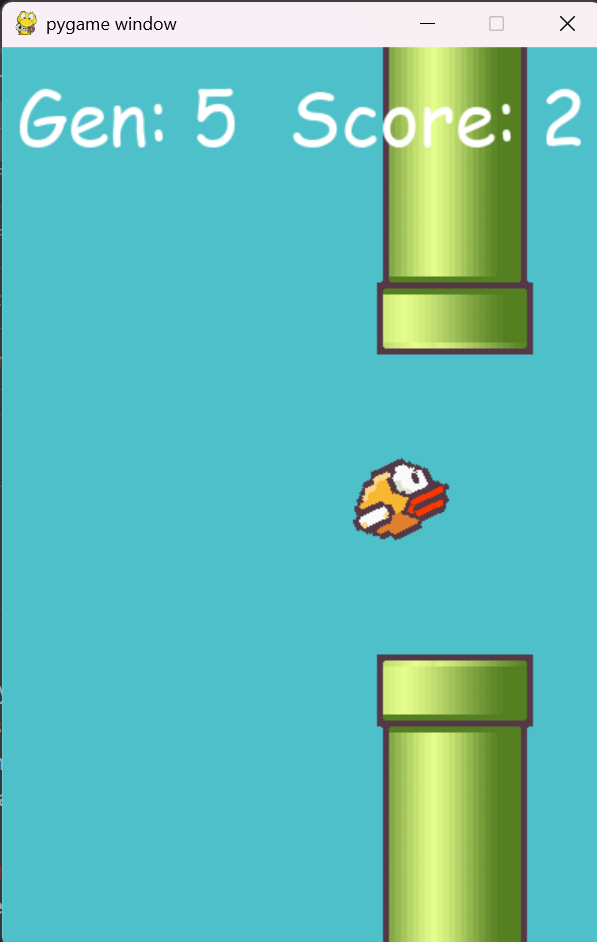

# Flappy Bird AI with NEAT

This is a Flappy Bird game with AI training using the NEAT (NeuroEvolution of Augmenting Topologies) algorithm. It's an AI-powered that trains neural networks to play the game autonomously. The AI creates a population of birds, each controlled by its own neural network that takes three inputs (bird's Y position, distance to top pipe, and distance to bottom pipe) and decides whether to jump or not. Through evolutionary processes, the AI learns to navigate through pipes by rewarding successful behaviors (staying alive earns +0.1 fitness per frame, passing pipes earns +5) and penalizing failures (hitting pipes costs -1 fitness). Over multiple generations, NEAT automatically evolves the network structure and weights, breeding the best-performing birds while eliminating poor performers. The best neural network is automatically saved to best_bird.pkl for future use.

